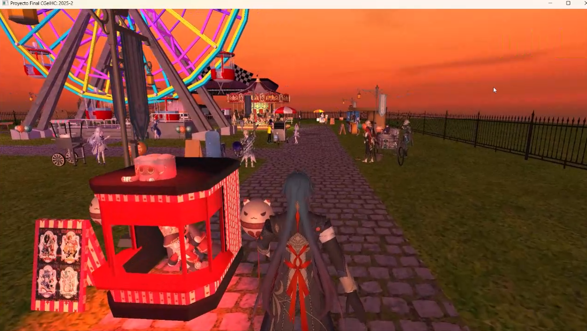

# Interactive 3D Fair

An interactive 3D fair simulation developed in **C++ and OpenGL**, focused on 3D graphics, animation, lighting, textures, and interactive camera systems.

## Overview

This project is an interactive 3D environment that simulates a fairground. It integrates 3D models, textures, materials, lighting, animations, and different camera systems to create an interactive experience.

The project also includes different environments and visual effects, such as day, sunset, and night settings.

## Main Features

- Interactive 3D environment.
- 3D models and textures.
- Multiple camera systems, including free and character-based cameras.
- Object and character animations.
- Lighting and material configuration.
- Day, sunset, and night environments.
- Interactive navigation and movement.
- Texture resource management and reuse to optimize memory usage.

## Technologies

- **C++**
- **OpenGL**
- **3D Graphics**
- **Geometric Transformations**
- **Lighting and Materials**
- **Texture Management**
- **Animation**

## Technical Highlights

- Implemented animations using `deltaTime` and mathematical functions to control movement.
- Implemented multiple camera systems for different types of interaction and navigation.
- Integrated 3D models, textures, materials, and lighting into an interactive environment.
- Identified and resolved a texture management issue by reusing previously loaded textures through a `map`, allowing more models to be loaded simultaneously without program failure.

## Repository Contents

This repository contains selected source code and documentation for the project.

Due to file size and asset limitations, the original 3D models and some project resources are not included.

## Demo

A demonstration of the interactive 3D fair, including navigation, cameras, animations, lighting, and different environments. 

**Click on the image below to watch the demo!**

---

# Español

## Descripción

Simulación interactiva de una feria en 3D desarrollada en **C++ y OpenGL**, enfocada en computación gráfica, animaciones, iluminación, texturas y sistemas de cámara interactivos.

## Descripción general

El proyecto consiste en un entorno 3D interactivo que simula una feria. Integra modelos 3D, texturas, materiales, iluminación, animaciones y diferentes sistemas de cámara para crear una experiencia interactiva.

El proyecto también cuenta con diferentes ambientes y efectos visuales, incluyendo escenarios de día, atardecer y noche.

## Características principales

- Entorno 3D interactivo.
- Integración de modelos y texturas.
- Múltiples sistemas de cámara, incluyendo cámara libre y cámara asociada al personaje.
- Animaciones de objetos y personajes.
- Configuración de iluminación y materiales.
- Ambientes de día, atardecer y noche.
- Navegación y movimiento interactivos.
- Gestión y reutilización de recursos de texturas para optimizar el uso de memoria.

## Tecnologías

- **C++**
- **OpenGL**
- **Computación Gráfica**
- **Transformaciones geométricas**
- **Iluminación y materiales**
- **Gestión de texturas**
- **Animación**

## Aspectos técnicos destacados

- Implementación de animaciones utilizando `deltaTime` y funciones matemáticas para controlar el movimiento.
- Implementación de diferentes sistemas de cámara para distintos tipos de interacción y navegación.
- Integración de modelos 3D, texturas, materiales e iluminación en un entorno interactivo.
- Identificación y resolución de un problema de gestión de texturas mediante la reutilización de recursos previamente cargados con `map`, permitiendo cargar una mayor cantidad de modelos simultáneamente sin que el programa fallara.

## Contenido del repositorio

Este repositorio contiene una selección del código fuente y la documentación del proyecto.

Debido al tamaño de los archivos y las limitaciones de los recursos, los modelos 3D originales y algunos recursos del proyecto no están incluidos.

## Demo

Demostración de la feria 3D interactiva, incluyendo navegación, cámaras, animaciones, iluminación y diferentes ambientes.

**¡Da click en la imagen de abajo para ver el demo!**

